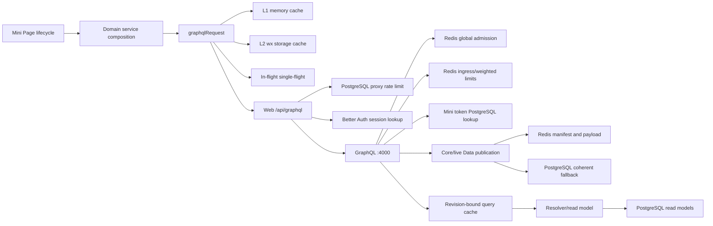

# LetLetMe 小程序接口调用、数据 Fetch 与缓存深度诊断

日期：2026-08-11

分析对象：

- Mini Program：`/Users/tong/AgentProjects/letletme-wechat-miniprogram`
- Web proxy：`/Users/tong/CursorProjects/letletme-web`
- GraphQL：`/Users/tong/CursorProjects/letletme-graphql`
- 本地链路：WeChat DevTools → `127.0.0.1:3001/api/graphql` → `127.0.0.1:4000/graphql`
- 运行数据：本地 GraphQL 当前连接远端 Redis 和 PostgreSQL
- 页面实测：25 个已注册页面，保留现有小程序缓存，非冷缓存压测

## 0. 结论先行

当前问题不是单一“慢 SQL”，而是五类问题叠加：

1. **契约错误先于性能问题**：`Players` 在 resolver 前被 complexity 600 拒绝，`LiveMatches` 使用了后端已不存在的 `upcoming` 参数。
2. **页面请求过碎**：25 页验收产生 34 次网络 operation，其中 5 个高调用页面贡献 21 次，占 61.8%。
3. **固定链路成本偏高**：本地 4000 的依赖是远端 Redis/PostgreSQL；3001 proxy 在热请求上又稳定增加约 300ms。
4. **缓存基础设施已有，但策略不统一**：小程序已有 L1、L2、single-flight、TTL 和 auth 隔离；问题主要是页面强刷、部分 service 无 TTL、页面另建无过期 last-good 缓存，以及无法观测真实命中率。
5. **后端需要优化，但优先级不是先改索引**：应先治理 proxy 固定开销、合并 page operation、补 resolver/cache/SQL 分段指标，再对被证实的 SQL 做 `EXPLAIN` 和索引优化。

核心判断：

| 层 | 是否需要优化 | 结论 |
|---|---:|---|
| 小程序调用策略 | 是，最高优先级 | 主要收益来源，预计同一 25 页路径可从 34 次降到约 15 至 18 次 |
| 小程序缓存框架 | 需要演进，不需推倒 | 基础正确，缺 SWR、统一策略、LRU/容量和 cache outcome 指标 |
| Web proxy | 是，高优先级 | Mini Bearer 仍经过 DB 限流和 Better Auth session lookup，热路径约增加 300ms |
| GraphQL 聚合层 | 是，中高优先级 | 缺 page-shaped aggregate/final-result cache；部分同源读取重复 |
| PostgreSQL 查询与索引 | 待证据 | 当前 operation 时长不是 SQL 时长，不能据此宣布慢查询 |
| Data publication/Redis 架构 | 方向正确 | revision pinning、请求内 memo 和 PostgreSQL fallback 均合理，需减少每请求固定 RTT 并补指标 |

## 1. 证据、范围与限制

### 1.1 当前证据

| 证据 | 结果 |
|---|---|
| 页面覆盖 | 25/25 |
| 网络 operation | 34 |
| 成功 | 32 |
| 失败 | 2 |
| API median | 806ms |
| API p95 | 2364ms |
| API max | 2504ms |
| 首屏 median | 751ms |
| 首屏 p95 | 817ms |
| 完整加载 median | 2118ms |
| 完整加载 p95 | 5059ms |
| runtime error event | 0 |
| 审计报告 | `/tmp/codex-miniprogram-direct-audit-019fefbc/all-pages-audit.json` |

### 1.2 必须保留的解释边界

- 本轮保留了模拟器现有缓存，因此“0 次网络请求”不能自动等同于“页面无数据依赖”。
- 当前 instrumentation 只能确认是否发生 `wx.request`，不能区分 L1、L2、页面 last-good 或已有 globalData。
- operation duration 是 Mini → proxy → GraphQL → Redis/PostgreSQL 的端到端时间，不是 SQL execution time。
- 本地 4000 连接远端依赖，实测包含 WAN RTT，不能直接代表生产同机部署的 resolver 性能。
- Web 本地启动使用了 `SKIP_WEB_DATABASE_CONTRACT=1` 绕过本地 auth DB baseline 检查；它不改变 proxy 请求代码，但属于本次本地验收条件。
- 本报告不声明生产部署状态，也不建议基于当前数据直接调整生产索引。

## 2. 端到端调用图



### 2.1 每次 Mini GraphQL 网络请求的固定路径

1. 小程序读取 token，构造 query、variables 和 cache key。
2. 未命中 L1/L2 时调用 `wx.request`。
3. Web proxy 解析 body，执行 PostgreSQL IP rate limit。
4. Web proxy 调用 Better Auth authorization session lookup，当前强制 `disableCookieCache: true`。
5. Web proxy 添加 signed ingress，转发 Mini Bearer。
6. GraphQL 至少执行 global admission、ingress/weighted rate limit。
7. 有 Bearer 时 GraphQL 查询 `bauth.mini_program_session` 验证 token hash。
8. GraphQL 获取 current season 和 core publication revision。
9. resolver 再进入 domain query cache、Redis publication 或 PostgreSQL read model。
10. 响应回到小程序后写入符合 TTL 的 L1/L2。

这意味着“减少一次 HTTP operation”不仅省一个 resolver，还能省掉整套 proxy、auth、rate-limit 和 publication 固定成本。

## 3. 当前缓存全景

### 3.1 小程序 GraphQL cache

当前 `graphql.service.ts` 已实现：

| 能力 | 当前行为 | 评价 |
|---|---|---|
| L1 | 进程内 `Map`，最多 120 项 | 有效，但满载时 clear-all，不是 LRU |
| L2 | `wx.setStorageSync` 持久化 | 有效，但没有总容量、atime 和逐项淘汰 |
| 请求隔离 | public 与 session namespace 分离，session key 使用 token hash | 正确 |
| query 版本 | cache key 包含完整 query、variables、variant | query 改动自动失效 |
| single-flight | 相同 request key 共享 Promise | 正确 |
| 强刷 | `forceRefresh` 跳过 cache read，成功后回填 | 正确 |
| 短 TTL | 小于等于 60 秒只留 L1 | 适合 live payload |
| 启动清理 | launch 后异步扫描 `gql:*` 过期项 | 可用 |
| 401 恢复 | auth refresh single-flight，最多一次 retry | 正确 |
| cache telemetry | 只有有限 `servedFromCache` 时间侧信道 | 不足 |
| error cache | error 不写缓存 | 正确 |
| stale-if-error | generic layer 没有 | 缺失 |
| partial GraphQL data | 只要 `errors` 非空就整次 reject | 阻碍安全合并多 root operation |

### 3.2 当前 service TTL

| 数据类别 | Mini 当前策略 | GraphQL 当前策略 | 主要问题 |
|---|---|---|---|
| current season/event/deadline | 动态缓存到 deadline；无 deadline 时 1h | core publication request memo | 页面 `onShow` 多次 `forceRefresh`，实测仍发 8 次 |
| teams | 24h，season variant | core publication | 良好 |
| team detail | 24h | core publication | 良好 |
| fixtures/window | 30m，season variant | core/live publication | 临近开赛和 live 阶段 30m 过长 |
| notice | 1h | Redis/domain | 良好 |
| entry profile | 1h | metadata 60s | 当前 rank/name 可能在客户端过旧 |
| entry leagues | 1h | reporting 5m | 客户端明显长于后端 freshness |
| entry history | 部分调用无 cache；My FPL 版本 30m | historical 1h | 同一数据存在两套调用策略 |
| entry event result | 部分调用无 cache；My FPL 版本 30m | metadata 60s | live/current GW 的 30m 过长 |
| entry transfers | live 30s，history 30m，variant 隔离 | enriched history 1h | 方向正确 |
| tournament list | 部分入口 5m，另一些入口无 cache | reporting 5m；setup 中 15s | 同一 operation 策略不一致 |
| tournament summary/stats | Mini 无 TTL | GraphQL reporting 5m | 每次进页仍承担 proxy 固定成本 |
| gameweek overall home | 30m | core publication | 可接受但 current/settled 应分层 |
| dream team/top performers | Mini 无 TTL | live publication，无最终 shaped cache | 两次 HTTP 重复同一 `eventLive` 聚合 |
| top transfers | Mini 无 TTL | 每个方向直接 read model 查询 | 可增加合并结果 cache |
| price board | 今日 30m，历史 24h | market 5m | 历史可更长；今日合理 |
| player price history | 6h | historical 1h | 合理 |
| live snapshot/content | 短 TTL、revision probe、30s poll、offline stop | live publication/request memo | 架构方向正确 |
| My FPL/Competitions last-good | 页面另存固定 key，无 expiry | 不适用 | 能离线回退，但无 age、统一失效和容量管理 |

### 3.3 GraphQL cache

GraphQL 已有以下正确基础：

- TTL 档位：live 10s、metadata 60s、reporting 5m、market 5m、historical 1h。
- query cache key 包含 core dataset revision，旧 publication 不会污染新 revision。
- core/live snapshot 在单个 GraphQL context 内 single-flight。
- Data publication payload 跨请求缓存解析结果；每次仍读取 active manifest，manifest 改变时才重新 `MGET` 全 payload。
- Redis publication 不可用时，使用一个 coherent PostgreSQL snapshot fallback。
- Entry、League、Tournament、Player Detail、Player Values 等已有 domain cache。
- 缓存故障大多 fail open 到数据库，malformed entry 会删除。

主要缺口：

- 通用 metrics 没有覆盖所有 domain 的 hit、miss、fallback。
- 没有 operation/resolver/DB phase histogram。
- `calcLivePointsByEntry` 没有按 live revision 缓存最终 shaped result。
- `eventLive` 每个独立 HTTP 都重新计算 totals。
- top transfers 两个 sibling resolver 分别查询 in/out。
- current request pipeline 有多次顺序 Redis RTT。

## 4. 25 页调用矩阵

“潜在调用”来自当前代码；“实测网络”受已有缓存影响。

| 页面 | 潜在数据路径 | 实测网络 | 诊断 |
|---|---|---:|---|
| Home | CurrentEvent → Entry、Fixtures、PlayerValues、EventOverallResult 并行；Notice 后台 | 0 | 已有缓存；冷启动潜在 5 个 operation |
| Account Link | REST email start/confirm/session delete | 0 | 本轮未交互 |
| Live Index | 无数据，仅导航 | 0 | 正常 |
| Data Index | 跳转 Explore | 1 | 多余 context refresh 可避免 |
| Entry Search | 用户提交后 GetEntry | 0 | 未提交，正常 |
| Entry Profile | GetEntry | 0 | cache-served |
| Live Entry | CurrentEvent → CalcLivePointsByEntry 与 transfer history 并行；30s snapshot probe | 2 | calc 已包含 `transfersList`，存在重复数据路径 |
| Live Match | CurrentEvent → LiveMatches；30s snapshot probe | 1 | 契约错误，HTTP 400 |
| Live Tournament | CurrentEvent → EntryTournaments → tournament live rows；30s probe | 1 | 空 tournament 后未继续 |
| Data Players | Players | 1 | complexity 600，resolver 前失败 |
| Player Detail | Player | 1 | 719ms |
| Data Teams | Teams | 0 | cache-served |
| Team Detail | Team | 0 | cache-served |
| Price | PlayerValues；按模式 lazy Players/History | 0 | cache-served/无价格变化 |
| Selections | CurrentEvent → EntryTournaments → TournamentSelectionStats | 0 | cache/空 tournament |
| Summary Entry | 实际进入 My FPL Team 数据路径 | 5 | 路由职责重复 |
| Summary Tournament | CurrentEvent → EntryTournaments → TournamentSummary | 1 | 空 tournament |
| Summary Gameweek | EventOverall + DreamTeam + Elite + Transfers 并行 | 4 | 同页最大确定性合并机会 |
| My FPL Overview | CurrentEvent → Snapshot、Entry、EventResult、Leagues | 4 | 组合层在客户端，潜在 5 个 read |
| My FPL Team | CurrentEvent → History、EventResult、Transfers、Snapshot | 5 | 适合 auth-derived aggregate |
| My FPL Leagues | CurrentEvent + EntryLeagues | 2 | context refresh 可复用 |
| Competitions | CurrentEvent + EntryTournaments | 2 | API 不慢，完整页面仍 5.2s |
| Explore | CurrentEvent | 1 | `onShow forceRefresh` 过度 |
| Explore Fixtures | CurrentEvent + Teams + FixtureWindow | 3 | Teams 通常可长期 cache |
| Performance | 本地 perf storage | 0 | 正常 |

## 5. 调用次数与慢 operation

### 5.1 调用集中度

| 页面 | 调用数 | 完整加载 |
|---|---:|---:|
| Summary Entry | 5 | 5059ms |
| My FPL Team | 5 | 4243ms |
| My FPL Overview | 4 | 3162ms |
| Summary Gameweek | 4 | 3744ms |
| Explore Fixtures | 3 | 3224ms |
| Competitions | 2 | 5202ms |
| Live Entry | 2 | 4008ms |

前 5 个页面占 21/34 次网络调用。优化这些页面比逐个微调低频页面更有效。

### 5.2 operation 聚合

| Operation | 次数 | 平均/单次 | 最大 | 累计 | 判断 |
|---|---:|---:|---:|---:|---|
| CurrentEventInfo | 8 | 831ms | 1527ms | 6649ms | 调用次数第一，主要是 refresh policy |
| EntryEventResult | 3 | 991ms | 1035ms | 2972ms | 多页面重复，client composition |
| CalcLivePointsByEntry | 1 | 2504ms | 2504ms | 2504ms | 真正 heavy root，但需 phase tracing |
| EntryTournaments | 3 | 816ms | 925ms | 2448ms | 可复用 5m list cache |
| EventEliteElements | 1 | 2364ms | 2364ms | 与 DreamTeam 重复 `eventLive` |
| EntryLeagues | 2 | 932ms | 1195ms | My FPL/Leagues 重复 |
| EventOverallTransfers | 1 | 1709ms | 1709ms | 两个方向 sibling read |
| GetLiveSnapshot | 2 | 816ms | 817ms | revision probe，可保持短 TTL |
| EntryTransferHistory | 2 | 795ms | 869ms | Summary/My FPL 重复 |
| EventDreamTeam | 1 | 1025ms | 1025ms | 与 Elite 可同 root |
| FixtureWindow | 1 | 994ms | 994ms | 动态 alias 已是单 operation |
| GetEntry | 1 | 879ms | 879ms | 可与 My FPL aggregate 合并 |

34 个 operation 的累计等待约 32.3s。累计时间不能等同于页面 wall time，因为多次请求并行，但可表示后端和网络总负载。

### 5.3 4000 与 3001 对照

同一台机器、同一运行时的补充探针：

| Query | 4000 直连 | 3001 proxy | 说明 |
|---|---:|---:|---|
| CurrentEvent cold | 1103ms | 632ms | 执行顺序和 cache state 不同，不做成对比较 |
| CurrentEvent warm | 208ms | 513ms | proxy 增量约 305ms |
| DreamTeam | 653ms | 786ms | 首次 live path |
| Elite | 408ms | 721ms | proxy 增量约 313ms |
| Dream + Elite 合并 | 408ms | 707ms | 与单独 Elite 几乎相同 |
| Calc cold | 1217ms | 982ms | cache state 不同 |
| Calc warm | 607ms | 908ms | proxy 增量约 301ms |
| PlayersForPicker | 579ms | 612ms | proxy 请求命中了前序后端 cache |
| Top Transfers | 424ms | 最终 429 | 快速序列耗尽 weighted budget |

结论：

- 热路径 3001 固定增量在多组探针上约 300ms，稳定指向 proxy rate-limit/session 阶段。
- 合并 Dream + Elite 不增加明显后端时间，能直接省一次完整 HTTP 固定成本。
- 快速遍历 high-cost roots 会触发 weighted rate limit，减少请求和合理合并也属于稳定性优化。
- 本地远端依赖 RTT 会放大每一次 Redis/DB round trip。

### 5.4 本地依赖 RTT

单独新连接诊断：

| 依赖 | 拓扑 | 结果 |
|---|---|---|
| Redis | remote | connect 694ms；连续 PING 240/256/272ms |
| PostgreSQL | remote | 首次 SELECT 735ms；warm SELECT 145/146ms |

因此当前 806ms API median 不能被解释为“某条 SQL 平均 806ms”。它包含远端依赖、多次安全检查、publication manifest、proxy 和 resolver。

## 6. 问题分级

### P0：先恢复正确性

#### P0.1 Develop 默认 endpoint 与安全架构冲突

当前 develop 默认值是：

```text
http://localhost:4000/graphql
```

但 4000 明确拒绝不可信直连，Mini 正式链路必须经过 Web signed proxy。当前只靠 DevTools storage override 指向 3001，不是可持续开发配置。

建议：

- develop 默认 GraphQL 改为 `http://localhost:3000/api/graphql`。
- GraphQL proxy URL 从 Web base 派生，不维护两套容易漂移的 endpoint。
- 仅保留显式 diagnostic override，不能作为日常成功路径。

#### P0.2 Players 契约

现状：

- Mini 使用通用 `players(limit, offset)`，选择 nested `team` 和多个字段。
- weighted complexity 根据 list limit 向 child fields 传播。
- 请求在 resolver 和 SQL 前被拒绝。

建议：

- Mini 改用已有 `playersForPicker`，分页 20 至 50。
- 不放宽 `maxComplexity=600`。
- 数据列表按 cursor 分页，按筛选条件缓存页。
- 如果页面必须一次展示全量，新增专用轻量 read model，而不是滥用通用 nested list。

#### P0.3 LiveMatches 契约

现状：

- Mini 仍发送 `liveMatches(upcoming: true)`。
- 后端 schema 是无参数 `liveMatches`。

建议：

- 直接删除 Mini 的 `upcoming`。
- 不建议后端恢复无实际语义的兼容参数。
- 增加 Mini GraphQL document contract check，至少在 CI 对当前 schema 校验全部 operation。

## 7. 目标 Data Fetch 方案

### 7.1 原则

1. App context 只维护 season、current/next event、deadline 和 principal，不承担页面业务 payload。
2. 页面首次进入只允许一个 owner 发起初始 fetch。
3. `onShow` 不等于 force refresh；只在 stale、跨 deadline、从后台恢复足够久或 revision 变化时 revalidate。
4. 下拉刷新才是显式 force refresh。
5. 相同数据用统一 query descriptor，不允许同一 operation 在不同 service 中各自决定完全不同 TTL。
6. 合并 HTTP operation 时保留 partial-failure 语义。
7. live 页面继续使用 meta probe → revision changed → full fetch，禁止固定周期无条件拉全量。

### 7.2 页面级 operation 收敛

| 页面 | 当前网络形态 | 目标 | 预期减少 |
|---|---|---|---:|
| Summary Gameweek | 4 个并行 HTTP | 1 个 operation：Overall + 单个 EventLive 的 Dream/Elite + Transfers in/out | 75% |
| My FPL Overview | context 后 3 至 4 个 read | 1 个 `myFplOverview` aggregate，entry 从 principal 派生 | 50% 至 75% |
| My FPL Team | 5 个 read | context + 1 个 `myFplTeam(eventId)` aggregate | 60% |
| Summary Entry | 重复 My FPL Team | 先 redirect，不启动旧 route fetch | 100% |
| Live Entry | calc + transfer history | 只用 calc 自带 `transfersList` | 50% |
| Home | 4 个业务 read + context/notice | 一个最多 5 roots 的 Home operation；notice 独立低优先级 | 40% 至 60% |
| Explore Fixtures | context + teams + window | 复用 context；teams 24h；window 独立 | 33% 至 67% |
| Tournament/Selections | 先 list 后 detail | 用 stored selection 乐观并行，list 返回后校验 | 减少 waterfall，不一定减少 operation |

### 7.3 合并 operation 的关键约束

当前 Mini client 看到任意 GraphQL `errors` 就 reject 整个响应。若把多个独立 root 合并，单个 root 失败会丢弃其他成功 data。

落地前必须二选一：

| 方案 | 适用 | 评价 |
|---|---|---|
| `allowPartialData` + field error metadata | Home、public summary | 改动小，但 cache 不能写入不完整 payload |
| 后端 aggregate 内部 settle reads，返回 availability | My FPL、Competition | 推荐，能保持现有 failure isolation 和 auth-derived identity |

禁止直接把多个 root 拼在一起后沿用“任意 error 全失败”的现有 client 行为。

### 7.4 生命周期规则

| 触发 | 行为 |
|---|---|
| 首次 `onLoad` | 读 cache；fresh 直接 render；stale 先 render 再 revalidate |
| 首次伴随的 `onShow` | 不重复 fetch |
| 前台恢复 < 30s | 不刷新非 live 数据 |
| 前台恢复 ≥ 30s | live probe；其他数据按各自 staleTime |
| deadline crossing | 失效 event context、current fixtures、current entry result |
| revision change | 只失效对应 event 的 live keys |
| pull-down | 当前页面相关 keys force refresh，不清全局缓存 |
| principal change | 清 session-scoped 与页面 last-good，不清安全的 public metadata |
| season change | 清所有 season-scoped keys 和 selected tournament references |

## 8. 建议的小程序缓存模型

### 8.1 四层模型

| 层 | 责任 | 建议 |
|---|---|---|
| L0 App context | season/event/deadline/principal | 单一权威，5 分钟 stale window + deadline invalidation |
| L1 Memory | 高频 query payload、live data | 真正 LRU，按 item count 和 estimated bytes 双限制 |
| L2 Storage | 可跨启动的 metadata/report/history | 带 version、scope、storedAt、staleAt、expiresAt、size |
| L3 UI last-good | 网络失败时展示 | 逐步并回 L2 SWR；保留 age 和来源，不再每页自建固定 key |

建议 cache envelope：

```ts
type CacheEnvelope<T> = {
  version: number
  scope: "public" | "session"
  season?: string
  eventId?: number
  principalHash?: string
  data: T
  storedAt: number
  staleAt: number
  expiresAt: number
  bytes?: number
}
```

建议 fetch result metadata：

```ts
type FetchMeta = {
  source: "l1" | "l2" | "network" | "stale"
  deduped: boolean
  forced: boolean
  storedAt?: number
}
```

### 8.2 推荐 freshness

| 数据 | staleTime | maxAge/persist | 说明 |
|---|---:|---:|---|
| CurrentEventInfo | 5m 或 deadline crossing | 到 deadline + 5m | 避免缓存数天且完全不 revalidate |
| Teams/base metadata | 24h | 7d，season/revision 隔离 | 低变化 |
| Player picker page | 15m | 24h | cursor/filter/sort 入 key |
| Entry profile | 15m | 24h | 手动刷新可强制 |
| Entry leagues/tournaments | 5m | 24h | membership 变化需较快可见 |
| Current fixtures，距开赛 >2h | 30m | 24h | 当前行为可保留 |
| Current fixtures，距开赛 ≤2h | 5m | 6h | 降低临场过期 |
| Live fixtures/points | 10s | L1 only | full fetch 由 revision 变化触发 |
| Live snapshot meta | 10s 至 30s | L1 only | 继续 30s poll |
| Current entry result | scheduled 5m；live 15s | 1h | 状态驱动 |
| Historical entry result/history | 1h | 7d | 已结算后可提高到 24h |
| Current GW transfers | 30s | L1 only | 当前策略合理 |
| Historical transfers | 30m | 7d | 当前策略合理 |
| Current summary | 5m | 24h | settled 后提高到 24h |
| Historical summary | 24h | 30d | revision/season 隔离 |
| Price today | 30m | 24h | 当前策略合理 |
| Price history | 6h | 30d | 当前策略合理 |
| Empty/negative result | 30s 至 60s | 不长期持久化 | 防止空态请求风暴 |

### 8.3 容量与淘汰

- L1 不应在达到 120 项时 clear-all，应改为 LRU。
- L2 建议设置 4 至 6MB 自有预算，不依赖平台存储耗尽后静默失败。
- 大型 tournament/live payload 不持久化。
- L2 维护小型 index，记录 key、bytes、atime、expiresAt。
- 启动只批量清 expired 和最老数据，避免扫描后逐项同步读造成启动抖动。
- last-good 最长保留建议 7 天；页面必须展示“上次更新于”而不是无限期只显示“上次成功结果”。

### 8.4 Cache telemetry

每次 fetch 至少记录：

- operation name
- source：l1、l2、network、stale
- outcome：hit、miss、expired、forced、deduped、error
- duration
- response bytes bucket
- cache age bucket
- page/surface
- 不记录 token、Entry ID、tournament ID、query variables

当前 `recordApi` 只记录真实网络请求，无法计算 hit ratio。应新增：

```text
client_fetch_total{operation,source,outcome}
client_fetch_duration_ms{operation,source}
client_cache_entry_bytes{operation,bucket}
```

## 9. 后端优化建议

### 9.1 Web proxy

#### 9.1.1 Mini Bearer fast path

当前 route 在发现合法 Mini Bearer 后，仍执行 Better Auth session lookup。建议：

- 有合法 Mini Bearer：不调用 Better Auth；只构造 signed ingress 并转发 Bearer。
- 无 Bearer、有网站 cookie：调用 Better Auth 并构造 website user envelope。
- 无 Bearer、无 cookie：public path，不做 session lookup。

GraphQL 仍是 Mini token 的最终验证者，因此不降低 auth 边界。该改动应先用 phase metrics 证明节省量。

#### 9.1.2 替换每请求 PostgreSQL rate-limit 写

当前 proxy 每个请求执行 `DELETE + INSERT ... ON CONFLICT UPDATE` CTE。建议优先级：

1. 使用 Redis 原子 limiter，与 GraphQL 相同的短 TTL counter。
2. 保留 proxy 轻量 admission，weighted cost 继续由 GraphQL 负责。
3. 若必须使用 PostgreSQL，至少拆出定时清理，不在每个 read request 中执行 prune。

不建议简单删除 proxy admission，因为它仍用于保护 Web function 自身。

#### 9.1.3 CDN cache 现实

Proxy 只有以下条件同时满足才给 CDN cache：

- operation name 在精确 allowlist。
- 无 session user。
- 无 Authorization。
- 响应成功且无 GraphQL errors。

Mini 的 operation names 多数与 Web allowlist 不同，且已登录 Mini 带 Bearer，因此当前实际是 `no-store`。不要把 `Cache-Control` 存在误认为 Mini 已命中 CDN。

### 9.2 GraphQL request pipeline

当前每请求可能包含：

- Redis global admission
- Redis ingress admission/precharge
- Redis weighted charge
- Mini token PostgreSQL lookup
- current season refresh，30s 周期
- Redis active publication manifest GET

建议：

- 为每个 phase 增加 histogram，再决定是否合并 Redis limiter。
- 对 global/ingress/weighted counter 使用 pipeline 或审查能否在 parse 后一次 Lua 完成。
- active publication manifest 可增加极短进程 stale window，例如 250ms 至 1s，或使用 publication invalidation signal；必须保留 revision 正确性。
- Mini session token 可做 15 至 30 秒安全 cache，key 为 token hash，并在 logout/revoke 时主动删除；若不能保证 revoke invalidation，则保持 DB source of truth。
- 本地开发应明确标记 remote dependency mode，性能报告不能与 production co-located mode混合。

### 9.3 GraphQL domain

#### 9.3.1 Event highlights

`EventDreamTeam` 和 `EventEliteElements` 都调用同一个 `eventLive` 全量路径。建议：

- Mini 单 operation 同时选择 `dreamTeam` 和 `topPerformers`。
- 可新增 `eventHighlights(eventId)` shaped result，按 live revision 缓存 10s，settled 后 1h。
- 当前实测 combined 与单 Elite 同为约 408ms direct，收益已被验证。

#### 9.3.2 移除 EventLive totals 的无效 player load

当前 `calculateTotalsForPerformances` 加载 players，取 position 后传入 helper，但 totals 计算实际只使用 live row 和 bonus override。GraphQL resolver 在请求 `player` 字段时又会单独 preload players。

建议：

- 删除 totals 阶段不参与计算的 player load。
- 只在 selection set 请求 `player` 时执行现有 bulk preload。
- 保留 core snapshot request memo。

这是高置信、低风险的后端 CPU/内存工作减少项。

#### 9.3.3 CalcLivePointsByEntry

当前 batch engine 已做对的事情：

- 八类共享读取并行。
- 单 entry 先得到 15 picks，再 targeted live read。
- player 使用批量 map，不做逐行 N+1。
- fixtures、teams、entry、picks、transfers、previous result 共享。
- pure CPU compute 与 I/O 分离。

因此不建议先重写 SQL。建议先增加 phase timing：

```text
snapshot_meta
shared_parallel_reads
targeted_player_live
compute
serialize
```

随后增加：

- key：core revision + live revision + eventId + entryId + includeLive。
- TTL：live 5 至 10 秒，scheduled 30 至 60 秒，settled 1h。
- 同 key cross-request single-flight。
- 返回 revision/checkedAt，供 Mini 判断 age。

#### 9.3.4 Top transfers

当前 in/out 是两个 read-model 查询，各自再做 event-scoped player enrichment。建议：

- 新增一个 `eventTransferLeaders(eventId, limit)`，一次返回 in/out。
- 或在 service 内为同 event/limit 建 request single-flight 和最终 1 至 5 分钟 cache。
- 若仍慢，再对底层 `season_id,event_id,transfers_*_event` 查询做 `EXPLAIN`。
- 不先假定缺索引。

#### 9.3.5 Tournament

现有 tournament result、ranking、entry list 已使用 reporting 5m cache，setup 未完成时使用 15s TTL，方向正确。

优先做：

- authorization membership phase timing。
- readiness phase timing。
- client 复用 list cache。
- 只有 traces 显示 read model 占主导时才优化 SQL/materialized view。

### 9.4 SQL 优化的准入条件

只有同时满足以下条件才进入索引/SQL改造：

1. resolver phase 指标确认 PostgreSQL 是主要耗时，而不是 proxy/Redis/publication/serialization。
2. 有命名 query 的 p50/p95/calls。
3. 有 `EXPLAIN (ANALYZE, BUFFERS)`。
4. 能确认现有 index。
5. 改动在 Data owner 仓库完成，并有相同参数集的前后对照。

当前数据只足以确认“链路慢”和“调用重复”，不足以宣布某个 PostgreSQL query 是慢查询。

## 10. 可观测性方案

### 10.1 Correlation

新增匿名 `X-Request-Id`：

- Mini 生成随机 request ID。
- Web 原样转发。
- GraphQL log/metrics 带 request ID。
- 禁止包含 token、openid、entry、email。

### 10.2 Web phases

```text
proxy_phase_duration_seconds{phase=body|rate_limit|session|sign|upstream|response}
```

### 10.3 GraphQL phases

```text
graphql_operation_duration_seconds{operation,outcome}
graphql_resolver_duration_seconds{domain,field}
graphql_db_query_duration_seconds{query_name,outcome}
graphql_cache_access_total{domain,layer,outcome}
graphql_publication_access_total{dataset,source,outcome}
graphql_auth_duration_seconds{family,outcome}
```

### 10.4 慢请求日志

仅当 operation 超过阈值时记录：

- operation name
- total duration
- phase durations
- cache outcomes
- DB query names
- response size bucket
- 不记录 variables 和个人标识

建议先在本地/trial 开启，确认 cardinality 后再用于 production。

## 11. 分阶段执行顺序

| 阶段 | 改动 | 预期收益 | 是否需后端 |
|---|---|---|---|
| A 正确性 | develop 走 proxy；修 Players；修 LiveMatches；operation schema check | 2 个失败归零，默认本地链路正确 | Mini 为主 |
| B 调用治理 | CurrentEvent stale policy；Summary 合并；Live Entry 去重复 transfers；Summary Entry 先 redirect | 34 次降到约 22 至 25 次 | 少量 GraphQL document |
| C Cache 可观测 | L1/L2/miss/forced/dedup 指标；last-good age | 获得真实 hit ratio | Mini |
| D Proxy fast path | Bearer 跳 Better Auth；Redis admission；phase metrics | 热请求固定开销目标下降 30% 至 50% | Web |
| E Aggregate/cache | My FPL aggregate；event highlights；calc final cache；combined transfers | 目标降到约 15 至 18 次，重页完整加载明显下降 | GraphQL |
| F SQL evidence | resolver/DB tracing、pg stats、EXPLAIN、索引 | 只优化被证明的 DB bottleneck | GraphQL/Data |

## 12. 验收标准

下一轮同样的 25 页验收建议使用两套 profile：

| Profile | 目的 |
|---|---|
| Cold | 清 Mini query cache，但保留登录；衡量首次使用 |
| Warm | 保留 cache；衡量日常导航 |

功能门槛：

- 25/25 页面无 runtime error。
- 0 个 GraphQL 契约错误。
- 默认 develop 不再直连不可信 4000。
- 快速自然导航不触发 429。
- partial aggregate failure 不丢成功数据。

调用门槛：

- Warm 全路径网络 operation ≤ 18。
- 一个 foreground 5 分钟窗口内 `CurrentEventInfo` ≤ 1 次，deadline crossing 和显式 refresh 除外。
- Summary Gameweek ≤ 1 个业务 HTTP。
- Live Entry ≤ 1 个业务 HTTP，snapshot probe 除外。
- My FPL Team ≤ 2 个业务 HTTP。

缓存门槛：

- 每个 fetch 可区分 l1、l2、network、stale、forced、deduped。
- 页面 last-good 显示 age。
- principal/season/event/revision 失效测试全部有明确证据。
- L2 有容量预算和逐项 LRU，不再 clear-all。

性能门槛：

- 分别报告 Mini client、proxy、GraphQL、Redis、PostgreSQL phase。
- 不再把 operation p95 直接称为 SQL p95。
- 先以当前基线做相对下降；production SLO 应在同机依赖拓扑下重新测定。

## 13. 最终判断

当前架构不是“没有缓存”，也不是“后端数据库整体太慢”。

更准确的判断是：

- **Mini 已有正确的 cache primitive，但页面调用策略没有统一治理。**
- **Web proxy 为每个碎片请求重复支付高固定成本。**
- **GraphQL 的 publication/read-model/cache 基础合理，但缺 page-shaped aggregate、最终结果短缓存和分段可观测性。**
- **本地远端 Redis/PostgreSQL 放大了每个 round trip，因此减少调用次数的收益远大于微调单个 JS mapper。**
- **数据库是否需要索引优化，必须在 phase tracing 后逐 query 决定。**

建议先执行 A、B、C，再根据 phase 数据执行 D、E；F 不能提前。
