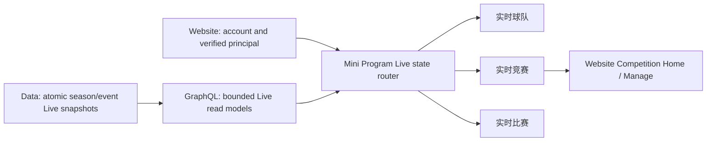
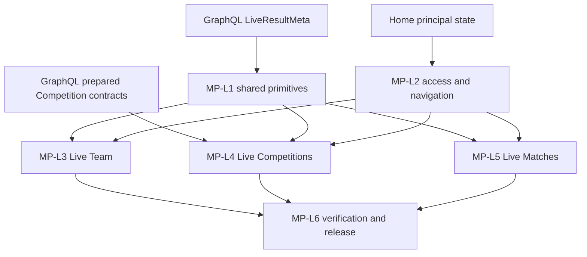

# LetLetMe WeChat Mini Program Live Section — High-Level Engineering Design

- **Status:** Proposed engineering design, ready for technical review
- **Recorded:** 10 August 2026
- **Section:** 1 of 4 — Live
- **Mini Program baseline:** `main@0d3b3ab`
- **Website comparison baseline:** `codex/web-adjustments-main-integration@547b169`
- **Scope:** LetLetMe Data and GraphQL Live contracts, Web-issued principal state, and the WeChat Mini Program Live client
- **Upstream product authority:**
  - `letletme-web/docs/product/letletme-four-section-specification.md`
  - `letletme-web/docs/product/letletme-cross-section-implementation-plan.md`
  - `letletme-web/docs/product/letletme-live-section-high-level-design.md`
  - `letletme-web/docs/product/letletme-competitions-section-high-level-design.md`

## 1. Purpose and fixed decisions

The Mini Program Live section is the fast, Chinese-only matchday companion for:

- the viewer's verified FPL team;
- prepared tracked official leagues and custom Competitions;
- current FPL matches and the events that explain live point movement.

The Mini Program optimizes for fast scanning, refresh reliability, and small-screen use. Website remains the canonical destination for deeper setup, management, history, sharing, and desktop analysis.

The fixed product decisions are:

- The Live menu contains **球队**, **竞赛**, and **比赛**.
- The default Live destination is the linked team's Live Points view; there is no required fourth Live Overview page.
- Team and Competition results may switch between the current and previous gameweeks.
- Matches show the current match window and next event only; they do not add a historical gameweek workspace.
- Live Competitions reads prepared objects only. It never starts an arbitrary official-league calculation.
- Competition creation, setup, roster, rules, invitations, recovery, and management remain Website-only.
- The Mini Program does not provide an AI Assistant.
- The Mini Program does not perform official FPL team actions or predict transfers, autosubs, captains, or optimized teams.
- An explicit public Entry ID may be viewed, but it never becomes the user's bound team.
- The initial implementation adds zero Mini Program runtime packages. It uses native WXML/WXSS and existing @vant/weapp components only.

## 2. Current implementation baseline

The current Mini Program already has a strong Live foundation.

| Area | Current capability | Main gap |
| --- | --- | --- |
| Live landing | Cards for team, match, and tournament Live | All three cards are blocked when no bound Entry exists, even though Matches is public |
| Live Team | Current/historical GW selector, score summary, lineup, bench, captain, chip, transfers, 30-second revision probe, last-good result retention | Binding states are reduced to `entryId` present/absent; snapshot metadata is not rendered as a consistent Live status |
| Live Matches | Playing/not-started/finished/next-event tabs, score and key-event rows, revision-aware refresh | No linked-team impact markers; no shared coverage/freshness status; landing-page access is over-gated |
| Live Tournament | Prepared-object selector, search, sort, ownership/exposure filters, incremental rows, partial-failure row retention | Uses generic Tournament identity and points-table output; does not distinguish tracked official leagues from custom formats |
| Refresh | Current-event-only polling, visibility stop, settled stop, revision probe before full refetch, request coalescing | Similar lifecycle orchestration is copied across three pages and does not explicitly stop for network-offline state |
| Data status | `eventId`, `revision`, `state`, `publishedAt`, and `checkedAt` | Missing season, authority, coverage, reason code, retained count, and one normalized presentation state |
| Account state | Mini Program inherits the Website-verified team | Live pages cannot distinguish unlinked account, linked-but-unbound account, stale-season binding, and transient data failure |

Current implementation references:

- `miniprogram/pages/live/index/index.ts`
- `miniprogram/pages/live/entry/entry.ts`
- `miniprogram/pages/live/match/match.ts`
- `miniprogram/pages/live/tournament/tournament.ts`
- `miniprogram/services/live.service.ts`
- `miniprogram/utils/live-refresh.ts`
- `miniprogram/models/live.ts`

## 3. Target technical structure



Ownership rules:

- **Data** owns official ingestion, internally consistent Redis publication, durable finalization, and custom Competition calculation facts.
- **GraphQL** owns bounded read models, authorization, query-specific coverage, and compatibility adapters.
- **Website** owns Better Auth, Mini Program sessions, verified FPL binding, binding season, and canonical Competition management links.
- **Mini Program** owns mobile navigation, page lifecycle, revision probing, last-good display, and Chinese presentation.

The Mini Program must not introduce another Live truth store or calculate a second result independently.

## 4. Shared contracts

### 4.1 Season and event context

All three Live paths consume the shared season context:

```text
SeasonContext
  season
  phase: PRESEASON | PRE_DEADLINE | LIVE | SETTLING | SETTLED | OFFSEASON
  currentEventId nullable
  nextEventId nullable
  latestSettledEventId nullable
  deadlineAt nullable
  checkedAt
  revision
```

Rules:

- Data/GraphQL is the event authority. The Mini Program never derives the current season or phase from the device calendar.
- An absent `currentEventId` is a preseason/offseason state, not a generic request error.
- Live Team and Live Competition may fall back to `latestSettledEventId` when there is no current event.
- Live Matches may show the next scheduled event when there is no active current event.
- Historical pages never silently switch back to the current event.
- When event context changes, previous-event content is cleared before the new label is rendered.

### 4.2 Live result metadata

Extend the existing Mini Program `LiveSnapshotStatus` additively to consume the shared Live contract:

```text
LiveResultMeta
  season
  eventId
  revision
  state: SCHEDULED | LIVE | SETTLED
  publishedAt
  checkedAt
  authority: OFFICIAL_FPL | LETLETME_RULES | MIXED
  coverage.expected
  coverage.succeeded
  coverage.failed
  reasonCode nullable
```

The Mini Program derives only presentation state:

```text
scheduled
fresh
refreshing
delayed
partial
final
offline
unavailable
```

Rules:

- Keep a pure `normalizeLiveDisplayState()` in the Mini Program repository.
- Test it with the same semantic golden cases used by GraphQL and Website; do not introduce a cross-language runtime package.
- `revision` determines whether the full payload changed. Device fetch time is not a result revision.
- `authority` explains rule ownership; it must not be confused with raw provider provenance.
- Competition retained-row count is added after the client merges failed rows with the previous same-context payload.
- Every result page renders one compact status strip with state, last checked time, coverage, and manual refresh.

### 4.3 Principal and access matrix

The Live section consumes the principal state defined by the Home/binding design instead of testing only `globalData.entryId`.

| Surface | Default access | Explicit object access | Binding behavior |
| --- | --- | --- | --- |
| Live Team | Current verified team | A public Entry deep link may be viewed read-only | Default route requires `VERIFIED`; explicit Entry never changes binding |
| Live Competitions | Prepared Competitions for current verified team | Authorized Competition deep link | Requires verified principal and membership/organizer authorization |
| Live Matches | Public | Current/next match status | Never blocked by missing team; linked-team impact is optional enhancement |

Principal states:

- `ACCOUNT_LINK_REQUIRED`: show account-link CTA for Team and Competition.
- `TEAM_BINDING_REQUIRED`: show Website team-binding CTA.
- `TEAM_REBIND_REQUIRED`: stop personal reads and show Website rebind CTA.
- `READY`: load the verified team and prepared Competitions.
- `OFFLINE_CACHED`: preserve last-known-good same-principal content and show offline status.

An entry-data 404, GraphQL 5xx, or network timeout must not clear the binding. Only an authoritative Website profile transition may unbind or replace it.

### 4.4 GraphQL read models

The target Mini Program consumes the same bounded contracts as Website:

| Read model | Mini Program use |
| --- | --- |
| `calcLivePointsByEntry` | One Team scoreboard, squad, captain/chip/played state, transfers linkage, and Live metadata |
| `entryPreparedCompetitions` | Cheap list of prepared objects and viewer summary; no full standings per list row |
| `competitionLive` | One selected Competition, viewer context, Live metadata, and discriminated result body |
| `liveMatches` | Current/next match groups and optional linked-entry impact map |

`competitionLive` must discriminate at least:

```text
OFFICIAL_CLASSIC_STANDINGS
OFFICIAL_H2H
CUSTOM_POINTS_TABLE
CUSTOM_GROUP_TABLE
CUSTOM_KNOCKOUT
```

Official H2H remains unavailable until its upstream contract is verified. The Mini Program must not render a custom knockout as if it were an official league table.

## 5. Navigation and Website handoff

### 5.1 Mini Program menu

Target Live submenu:

```text
实时
  球队
  竞赛
  比赛
```

Changes:

- Rename **联赛** to **竞赛** so the label covers tracked official leagues and custom Competitions.
- Tapping the main Live entry opens **球队** by default when the principal is ready.
- The existing `pages/live/index/index` may remain as a compatibility/state-router page during migration, but it is not a fourth permanent Live destination.
- Missing binding must not block **比赛**.
- Preserve contextual links from a Competition row to an Entry Live page and from a Match impact marker back to the linked team.

### 5.2 Website handoff

The Mini Program provides read-only Competition Live. These actions hand off to Website:

- no prepared Competition → My Competitions / Create;
- setup or recovery required → Competition Home or Manage;
- rules, roster, invitations, archive, or history → canonical Competition page;
- unsupported full-format detail → the same Competition page on Website.

Handoff rules:

- Use Simplified Chinese canonical URLs.
- Prefer canonical links supplied through the shared link contract instead of scattering raw Website paths in Mini Program pages.
- During route migration, the link registry may map canonical `/zh-CN/competitions*` destinations to current `/zh-CN/tournament*` compatibility routes.
- Never place Mini Program bearer tokens, email addresses, or Entry IDs in a handoff URL.
- Configure and verify the Website domain as a WeChat `web-view` business domain.

### 5.3 Mini Program canvas and operation hierarchy

Live is a fast matchday surface, so its design target is the actual WeChat viewport rather than a reduced desktop dashboard.

Runtime layout rules:

- Read windowWidth, windowHeight, safeArea, and the menu-capsule boundary through wx.getWindowInfo().
- Treat 320–430 CSS px portrait widths as the supported canvas range. Verify at least 320 × 568, 375 × 667, 390 × 844, and about 430 px wide.
- Reserve the native navigation/capsule area, the custom bottom navigation, and the bottom safe area before calculating usable content height.
- Use a single vertical reading flow. On compact screens, metric summaries use at most two columns.
- Interactive targets are at least 44 CSS px (approximately 88rpx) high or wide.
- Each card or list row exposes one primary action and at most one secondary action. Remaining actions use one non-nested action sheet or a dedicated page.
- Horizontal scrolling is allowed only for a clearly labelled compact table or bounded fixture/result strip; it is never required to discover the page's primary result.

Operation hierarchy:

~~~text
实时 -> 球队 -> 球员明细 / 探索证据
实时 -> 竞赛 -> 已选结果 / 参赛者
实时 -> 比赛 -> 比赛详情 / 球队影响
~~~

- A core result is reachable within three page transitions from the bottom navigation.
- The section has three destinations, not a nested overview plus three workspaces.
- A screen exposes no more than two primary selectors at once. Secondary filters move to an action sheet or a separate filter page.
- A screen has no more than four permanent tabs.
- No interaction depends on hover, tooltip-only content, right click, precise drag, desktop keyboard shortcuts, or a modal opened from another modal.
- Disclosure is inline; long detail is a page. Closing a detail returns to the same event, Competition, scroll position, and refresh context.

The Website handoff is a full-page task transition. Mini Program UI must not be designed to float over web-view. The target must be a direct, mobile, single-column task URL and pass the same 320–430 CSS px width fixtures; its height and scroll stack are independent because web-view replaces the native page. The handoff explains possible Website login, provides copy-link fallback, and revalidates principal plus Live context after return. Frequent Live reads remain native.

## 6. Shared Mini Program infrastructure

Create or extract the following repo-native primitives:

```text
miniprogram/components/live-status-bar/
  live-status-bar.ts
  live-status-bar.wxml
  live-status-bar.wxss
  live-status-bar.json

miniprogram/components/live-section-nav/
  live-section-nav.ts
  live-section-nav.wxml
  live-section-nav.wxss
  live-section-nav.json

miniprogram/models/live.ts
miniprogram/utils/live-event-context.ts
miniprogram/utils/live-status.ts
miniprogram/utils/live-refresh.ts
miniprogram/utils/live-refresh-controller.ts
```

Responsibilities:

- `live-status-bar`: state, freshness, coverage, last update, refresh progress, and manual retry.
- `live-section-nav`: Chinese Team/Competition/Match navigation and active state.
- `live-event-context`: requested/current/latest-finalized event resolution.
- `live-status`: pure metadata-to-presentation normalization.
- `live-refresh`: pure revision comparison and polling eligibility.
- `live-refresh-controller`: timer ownership, online/visibility checks, request coalescing, revision probe, and full-fetch callback.

Page-specific mapping remains inside each feature page. Do not add a general state-management framework for this work.

Package rule:

- Add zero runtime npm dependencies for the initial Live delivery.
- Reuse existing @vant/weapp and native picker, scroll-view, action-sheet, IntersectionObserver, pull-to-refresh, and sharing APIs.
- Do not port Website charting, Radix, toast, virtual-list, rich-text, or command-palette packages.
- Prefer bounded GraphQL reads, pagination, incremental setData updates, and small repo-native components.
- Any future dependency exception requires separate approval and evidence that a native implementation cannot satisfy the requirement.

## 7. Page designs

### 7.1 Live Team

Purpose: answer “我的球队现在得了多少分，谁贡献了这些分？”

Required behavior:

1. Default to the verified principal Entry.
2. Permit an explicit read-only Entry deep link without persisting it as the principal Entry.
3. Support current and previous GW selection.
4. Poll only for the current unsettled event.
5. Render score, net score, transfer cost, captain, chip, played/to-play, lineup, bench, manager chip player where present, and transfers.
6. Keep transfer loading/failure independent from the score payload.
7. Preserve same-entry/same-event last-good data during refresh failure.
8. Show scheduled, delayed, partial, final, offline, and unavailable status explicitly.
9. Do not add official team mutation controls, autosub simulation, or recommendation language.
10. Keep the score strip to at most two metric columns on compact screens; render the squad as a vertical lineup and bench list rather than a width-dependent pitch.
11. Show only the GW selector as the primary control. Season context and less common actions remain secondary.

Primary files:

- `miniprogram/pages/live/entry/entry.ts`
- `miniprogram/pages/live/entry/entry.wxml`
- `miniprogram/pages/live/entry/player.ts`
- `miniprogram/pages/live/entry/transfer.ts`
- `miniprogram/services/live.service.ts`
- `miniprogram/services/entry.service.ts`

### 7.2 Live Competitions

Purpose: answer “我已经准备好的联赛或自定义竞赛现在排名、对阵和差距怎样？”

Required behavior:

1. Load a bounded `entryPreparedCompetitions` index first.
2. Show kind, format, readiness, participant count, and compact viewer position/matchup.
3. Fetch the full result for only the selected Competition.
4. Render official standings, custom points/group tables, and knockout/matchup bodies by discriminator.
5. Keep search, relevant filters, viewer row highlighting, Entry-to-Team-Live links, and incremental rendering.
6. Support current and historical GW; disable polling for historical/final results.
7. Retain failed rows only from the same Competition/event revision context.
8. Mark retained rows visibly, sort them after fresh rows, and exclude them from newly computed rank/average summaries.
9. Show partial coverage and failed-row count without blanking successful rows.
10. Never create, configure, retry setup, edit, invite, archive, or delete a Competition in the Mini Program.
11. Use Website handoff for empty, preparing, failed-setup, management, rules, roster, and full-history states.
12. Keep the selected Competition plus one sort/filter control visible. Ownership, exposure, and advanced filters share one non-nested action sheet.
13. Render each result discriminator as mobile-first cards or short rows. Knockout displays one selected round; it does not squeeze a complete bracket into the viewport.

Primary files:

- `miniprogram/pages/live/tournament/tournament.ts`
- `miniprogram/pages/live/tournament/tournament.wxml`
- `miniprogram/services/tournament.service.ts`
- `miniprogram/services/live.service.ts`
- `miniprogram/services/live-tournament.ts`

The physical route may remain `live/tournament` during compatibility, while the user-facing label becomes **实时竞赛**.

### 7.3 Live Matches

Purpose: answer “哪些比赛正在进行，比分和哪些事件正在影响 FPL 得分？”

Required behavior:

1. Remain usable without a linked account.
2. Keep playing, not-started, finished, and next-event grouping.
3. Use the current/next event context only; do not add a historical GW picker.
4. Adopt the shared status bar and revision refresh controller.
5. When the viewer is bound, optionally mark relevant players as `首发`, `队长`, `副队`, or `替补`.
6. Keep the public match payload independent of the viewer-impact enhancement.
7. Preserve last-good same-event matches through temporary refresh failure.
8. Show preseason/no-current-event as scheduled content rather than a system error.
9. Keep no more than four status tabs. The list is the first scan surface and match impact is a downstream detail, not another persistent dashboard column.

Primary files:

- `miniprogram/pages/live/match/match.ts`
- `miniprogram/pages/live/match/match.wxml`
- `miniprogram/services/live.service.ts`

## 8. Refresh, cache, and failure rules

The existing revision-aware behavior remains the foundation.

### Polling

- Probe every 30 seconds only when the page is visible, the device is online, the selected event is current, and the snapshot is not settled.
- Stop polling on `onHide`, `onUnload`, offline state, historical selection, and `SETTLED`.
- On resume or network recovery, perform one immediate revision probe.
- Fetch the full payload only when revision or event changes.
- Coalesce duplicate probes and full requests.
- Ignore stale responses using request ID plus context-key guards.

### Context keys

Every last-good payload is scoped by:

```text
season + eventId + surface + objectId + viewerPrincipalRevision
```

Rules:

- Never retain Team A under Team B, Event A under Event B, or Competition A under Competition B.
- A principal transition invalidates personal Team and Competition caches.
- Public Match content does not need to be cleared when only the viewer binding changes; its optional viewer-impact overlay does.
- Live payloads remain short-lived and revision-controlled. Do not add a second durable client truth store.
- Prepared-Competition metadata may use a bounded list TTL, but pull-to-refresh and Website-return flow must bypass it.

### Failures

- Revision-probe failure keeps current data and shows delayed/offline status.
- Full-refresh failure keeps last-good same-context data.
- Partial Competition failure keeps successful rows plus eligible retained rows.
- No previous data plus failure renders unavailable/retry.
- Empty scheduled data, no prepared Competition, no published squad, and request failure are distinct states.
- Do not weaken API rate limits to make polling appear more responsive.

## 9. Work packages

### MP-L1 — Contract adaptation and shared primitives

1. Extend Mini Program models for `SeasonContext`, `LiveResultMeta`, coverage, authority, and reason code.
2. Add golden contract fixtures and compatibility parsing for the old snapshot shape.
3. Extract event-context, status-normalizer, and refresh-controller primitives.
4. Add the shared Live status bar and section navigation components.

### MP-L2 — Principal and navigation integration

1. Consume the Home/binding principal state.
2. Replace raw `entryId` gates with the access matrix.
3. Allow public Matches without binding.
4. Rename the menu label from 联赛 to 竞赛.
5. Convert `live/index` into a temporary state router or redirect-compatible entry.

### MP-L3 — Live Team migration

1. Adopt shared event/status/refresh primitives.
2. Separate principal-default Entry from explicit read-only Entry.
3. Add full metadata presentation and historical/fallback event states.
4. Preserve independent transfer loading and existing lineup behavior.

### MP-L4 — Live Competitions migration

1. Consume the cheap prepared-Competition index.
2. Fetch one selected discriminated result.
3. Add Competition kind/format/readiness presentation.
4. Make retained-row semantics explicit.
5. Add Website handoffs and remove any management implication from Mini Program copy.

### MP-L5 — Live Matches migration

1. Remove binding gate.
2. Adopt shared event/status/refresh primitives.
3. Add optional viewer-impact markers.
4. Add scheduled/offseason and network-recovery states.

### MP-L6 — Observability, compatibility, and release

1. Add sanitized Live metrics and transition logging.
2. Run contract, helper, page, DevTools, and real-device verification.
3. Keep old GraphQL fields and physical routes during one compatibility window.
4. Remove duplicate lifecycle code only after production parity evidence.

## 10. Dependency and delivery order



Recommended rollout:

1. Freeze additive contract fields and fixtures.
2. Deploy required Data/GraphQL contracts first.
3. Deploy Website principal and canonical-link support.
4. Land Mini Program shared primitives and compatibility parsing.
5. Migrate Team, then Matches, then Competitions.
6. Upload a WeChat development version and verify it separately from review submission and public publication.
7. Remove old fields/routes/lifecycle code only after an observation window.

The cross-repository production order remains **Data → GraphQL → Website → Mini Program**.

## 11. Compatibility and rollback

- GraphQL additions are nullable/additive until all active clients understand them.
- When only the old snapshot shape exists, the Mini Program may show basic scheduled/live/final state but must not invent authority or coverage.
- Keep `pages/live/tournament/tournament` and old route constants while user-facing terminology migrates to Competition.
- Keep `pages/live/index/index` until every existing Home/menu link has a verified replacement.
- A Mini Program rollback must continue reading the old GraphQL fields.
- Backend rollback must keep the published revision pointer internally consistent with its payload.
- Cleanup is a separate change after release evidence, not part of the first migration.

## 12. Verification plan

### Unit and contract tests

Cover:

- event resolution for current, historical, preseason, and offseason;
- status normalization for scheduled, fresh, delayed, partial, final, offline, and unavailable;
- revision unchanged versus changed;
- visibility, offline, current-event, historical-event, and settled polling rules;
- stale response rejection after Entry, event, Competition, status-tab, or principal change;
- retained Competition row ordering and exclusion from fresh summaries;
- public Match access and principal-gated Team/Competition access;
- explicit Entry view never updating the stored principal Entry.

Repository checks:

```text
npm run typecheck
npm run lint
npm test
npm run package:check
git diff --check
```

Also verify that every registered route in `miniprogram/app.json` still resolves to a complete `.ts`, `.wxml`, `.wxss`, and `.json` page unit.

### WeChat DevTools and real-device scenarios

Verify:

- account unlinked, linked-but-unbound, verified, stale-season, and offline-cached principal states;
- public Matches without an account;
- current Team Live, historical Team result, no published picks, transfers absent, and refresh failure;
- no prepared Competition, one/multiple objects, each supported result discriminator, partial rows, and Website handoff;
- playing, not-started, finished, and next-event Match tabs;
- revision unchanged suppresses full fetch;
- revision changed performs one coalesced full fetch;
- backgrounding stops polling and foregrounding performs one probe;
- network loss keeps last-good content and recovery resumes correctly;
- compact Chinese copy, safe-area layout, scroll performance, outdoor legibility, and touch target sizes;
- 320 × 568, 375 × 667, 390 × 844, and approximately 430 px-wide portrait canvases;
- no clipped primary result behind the native capsule, bottom navigation, or safe area;
- Team, Competition, and Match core evidence stays within the documented three-transition hierarchy;
- at most two primary selectors, four permanent tabs, and one non-nested action sheet per screen;
- web-view full-page behavior, direct mobile target, explained login, copy-link fallback, and return revalidation;
- package-lock/package manifest remains unchanged by Live work and no new Mini Program runtime package is bundled.

Preseason or no-live-data evidence is a legitimate data state. It must be recorded as a deferred live-game checkpoint, not reported as a functional failure.

## 13. Observability

Record sanitized fields:

```text
surface
season
eventId
isCurrentEvent
snapshotState
revisionChanged
snapshotAgeBucket
displayState
coverageExpected
coverageFailed
retainedRowCount
probeDurationBucket
fullFetchDurationBucket
handoffTargetType
```

Do not log bearer tokens, email, `openid`, manager/team names, or full payloads. Entry and Competition IDs should be omitted or one-way bucketed unless an operational incident explicitly requires scoped diagnostics.

Success indicators:

- revision probes per full payload fetch;
- time from published revision to visible Mini Program revision;
- percentage of refresh failures that preserve last-good content;
- partial Competition result rate and recovery time;
- polling activity while hidden/offline, which should be zero;
- Website Competition handoff completion and return refresh success.

## 14. Completion criteria

The Mini Program Live design is complete when:

- Team, Competition, and Match pages consume one season/event and Live metadata contract.
- Current-event polling is revision-aware, coalesced, visibility/online-aware, and stops after settlement.
- Historical Team and Competition views never poll or display current-event data under the wrong GW.
- Live Matches works without account binding.
- Default Team and Competition views use the verified current-season principal; explicit Entry view remains read-only.
- Live Competitions loads a cheap index, calculates only the selected object, and renders results by type.
- Partial Competition results preserve and visibly mark only eligible same-context rows.
- Competition creation and management are absent from Mini Program and have clear Chinese Website handoffs.
- The Mini Program exposes no AI Assistant or official FPL team actions.
- Every Live surface works across the 320–430 px portrait canvas range, respects safe areas, and keeps the core result within three page transitions.
- No page exceeds two primary selectors or four permanent tabs, and no core interaction requires desktop-only behavior.
- Live delivery adds zero runtime packages and treats web-view as a full-page Website handoff rather than an embedded extension of the native page.
- Unit, contract, DevTools, real-device, and first-live-gameweek verification pass with recorded evidence.
